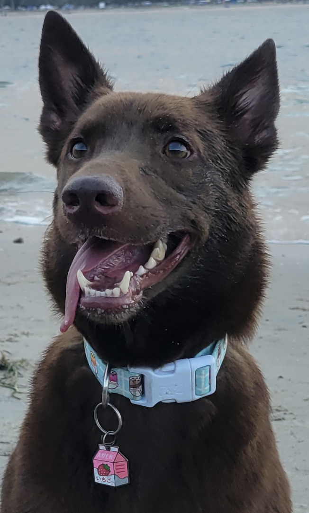

# About Me

Hello my name is John! I am currently a 4th year CS (with a Specialization in Bioinformatics) student. To harness my programming skills, I currently volunteer as a bioinformatics undergradute researcher at Moores Cancer Center at UC San Diego Health in [Dr. Hojun Li's lab](https://www.hlilab.org/) where I use various bioinformatics tools via R and Python. My work mainly focuses on analyzing gene expression using RNA-seq data. Currently, I am trying to determine which Hif3-A gene isoform induces cell differentiation of BFUE to CFUE through analysis of alternative splicing. 

 

Outside of school, I ***LOVE*** to play and watch tennis. I also have a 3 year old dog named June. He is a German Shepherd and Belgian Malinois mix. We both love to go on hikes especially on cooler days. 

# Programming Experience

My programming experience is limited to the work I have done during my time in UCSD and Community College. I have experience with using the following programming languages:
- C
- C++
- Python
- Java
- bash
- R

Most recently, I have been tasked by my lab PI to perform analysis on the Socs1 gene (with respect to the addition of Dexamethasone). With this work, I have been employing Python libraries such as Numpy and Pandas. As part of the analysis, I am also tasked to visualize my results and as such, I have been using visualization libraries such as seabourne and matplotlib in my project. This is my favorite part of every project I work on. It is very satisfying to watch the data with pretty colors! 
