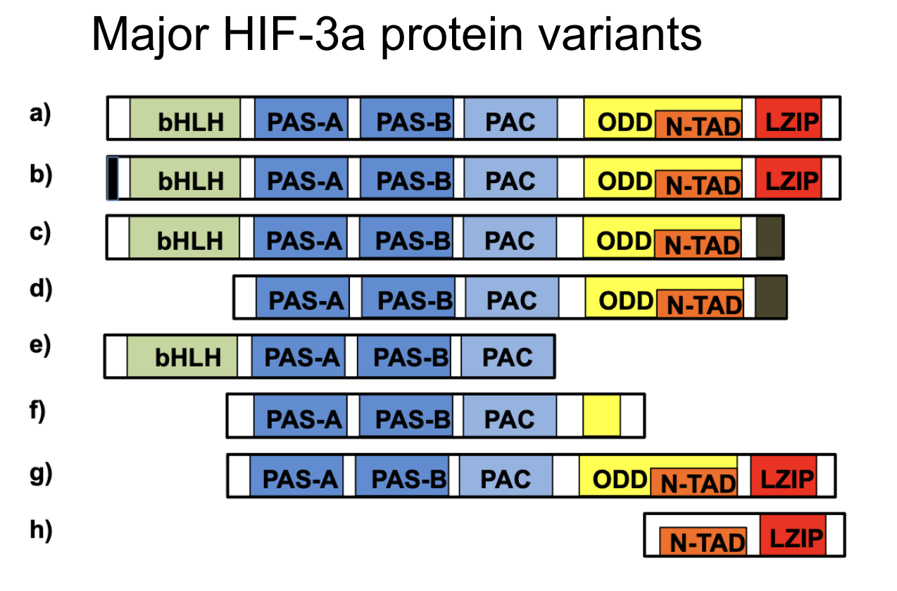

## Introduction

Hello my name is John! I am currently a 4th year CS (with a Specialization in Bioinformatics) student. To harness my programming skills, I currently volunteer as a bioinformatics undergradute researcher at Moores Cancer Center at UC San Diego Health in [Dr. Hojun Li's lab](https://www.hlilab.org/) where I use various bioinformatics tools via R and Python. My work mainly focuses on analyzing gene expression using RNA-seq data. Currently, I am trying to determine which Hif3-A gene isoform induces cell differentiation of BFUE to CFUE through analysis of alternative splicing. 

 

Outside of school, I ***LOVE*** to play and watch tennis. I also have a 3 year old dog named June. He is a German Shepherd and Belgian Malinois mix. We both love to go on hikes. 

##
